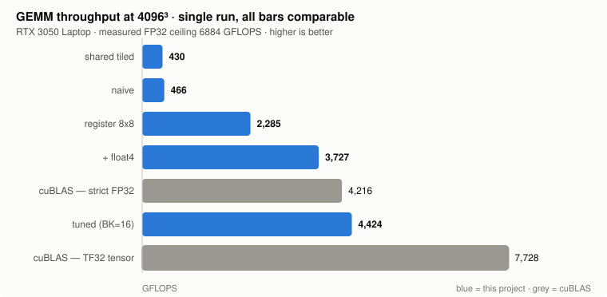
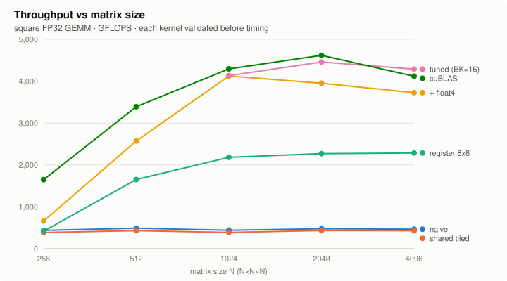
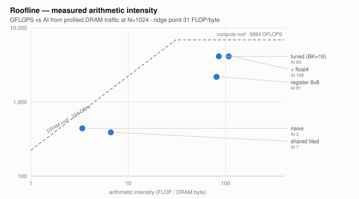

# Tinyforge

I wanted to learn how GPUs actually work, so I wrote a matrix multiply and then spent a few weeks making it fast. This repo is the result: five FP32 GEMM kernels, from a naive one-thread-per-output version to something that keeps up with cuBLAS, with the profiler output that explains each step.

It runs on an RTX 3050 Laptop (sm_86). Everything is written from scratch — cuBLAS is here only as a stopwatch and an answer key.

**End result: 9.5× faster than where I started, and level with cuBLAS when cuBLAS is held to the same numeric format.**



## Read the last bar first

The bottom bar is cuBLAS with its tensor-core path turned on. It's 1.75× faster than my best kernel, using hardware I never touched.

I benchmark against cuBLAS in strict FP32 mode (`CUBLAS_PEDANTIC_MATH`) because I need it as a correctness oracle, and TF32's shorter mantissa won't hold my comparison tolerance. That restriction is also what makes the comparison close. So the claim I'll defend is narrow:

> On square matrices sized for my kernel's constraints, on this specific card, with both restricted to strict FP32, my kernel matches cuBLAS.

Not "faster than cuBLAS." cuBLAS handles any shape, any transpose, batching, every data type and every NVIDIA GPU. Mine needs M and N divisible by 128 and K divisible by 16, and does nothing else. That generality is most of the gap I closed.

## Numbers

Square GEMM at 4096³, all measured in one run so the bars above are directly comparable.

| Kernel | GFLOPS | vs naive | % of measured FP32 ceiling |
|---|---|---|---|
| naive | 466 | 1.00× | 7% |
| shared-memory tiled | 430 | 0.92× | 6% |
| register tiled, 8×8 per thread | 2285 | 4.90× | 33% |
| + `float4` loads | 3727 | 8.00× | 54% |
| **tuned, BK=16 + padding** | **4424** | **9.49×** | **64%** |
| cuBLAS, strict FP32 | 4216 | 9.05× | 61% |
| cuBLAS, TF32 tensor cores | 7728 | 16.6× | — |

The ceiling is measured, not taken from a spec sheet. I wrote a pure-FMA microbenchmark ([`fp32_peak.cu`](src/kernels/fp32_peak.cu)) and got 6884 GFLOPS. I'd been quoting 9100 from a datasheet until then, which made every percentage in this project wrong by about 30%.

Full data in [`results/final_sweep.csv`](results/final_sweep.csv).



## How it went

**The naive kernel wasn't memory-bound, which I did not expect.**

I assumed bandwidth was the problem, because that's what everyone says about naive matmul. Nsight said the load/store unit was at 99.4% while DRAM sat at 58% and the FMA units idled at 28%. The problem wasn't the bytes, it was the sheer number of load instructions. That one distinction ended up driving every decision after it.

**Then shared-memory tiling made it slower.**

This is the standard next step and it cost me 8%. It did what it advertises — DRAM traffic dropped 4.7× — but DRAM had spare capacity the whole time. The inner loop still ran two loads per multiply-add, and a shared-memory load burns a load/store slot exactly like a global one. So the bottleneck didn't move, and I'd added a tile-load phase and two barriers per iteration on top of it.

I kept this kernel in the repo. It's the most useful thing I learned: an optimization is only good relative to a bottleneck you've actually measured. Tutorials show this step winning because their baselines aren't coalesced. Mine already had an 88% L1 hit rate, so there wasn't much redundant traffic left to remove.

**Register tiling was the fix, 4.9×.**

To change the load-to-multiply ratio, a thread has to own more than one output. Giving each thread an 8×8 block of C turns the inner loop into an outer product — 16 loads feeding 64 multiply-adds instead of 2 feeding 1. LSU pressure dropped from 99% to 62%. Adding `float4` loads cut load instructions another 4× for a further 1.6×, and a deeper K-slab gave 11% more.

**Occupancy dropped to a third and it got faster anyway.**

Register tiling pushed me from 36 to 127 registers per thread, so only 2 blocks fit per SM and occupancy fell from 99% to 33%. I expected that to hurt. It didn't, because occupancy exists to hide latency by having lots of warps to switch between, and this kernel instead gives each thread 64 independent multiply-adds to chew through. One warp can keep the pipelines busy on its own.

Worth being precise about: low occupancy isn't good here. It's a price that happened to be affordable. If I'd raised register usage without adding independent work per thread, the same drop would have wrecked performance.

**Fixing bank conflicts was worth about 1%.**

Padding the shared tile took bank conflicts from 16,777,216 to zero — I checked the hardware counter, it really is zero. It bought roughly nothing. Third time in this project that a textbook optimization turned out to target something that wasn't the bottleneck.

There's a limit to the trick, too: `float4` alignment forces the padding to be a multiple of 4, and under that constraint no pad value spreads four column groups across banks. Padding runs out of road; XOR swizzling is what gets past it, and I haven't done that.



Arithmetic intensity here comes from profiled DRAM traffic rather than the theoretical model, so it accounts for cache effects. The optimized kernels sit past the ridge point at 31 FLOP/byte, which means they're genuinely compute-bound; the naive and shared-memory versions are still far to the left.

## Measuring this thing was harder than writing it

Two of my "results" turned out to be bugs in my own benchmark harness, and both had been wrong for several kernels before I noticed.

A laptop GPU sits at 210 MHz when idle and 1950 MHz under load. Short kernels never wake it up. My peak benchmark reported 776 GFLOPS on the first run for exactly this reason — the code was fine, the card was asleep.

Worse: at N ≤ 1024 I run a CPU correctness check, which is a single-threaded triple loop taking several seconds. The GPU idles all the way back down during it, and then I start timing. That understated my small-matrix numbers by up to 8×. I only caught it because N=1024 was doing eight times less work than N=2048 in the same wall-clock time, which is impossible.

The harness now burns some junk compute to wake the card after all host-side work and immediately before timing. Timing itself uses CUDA events, discards warmup runs, and reports mean/std/min/max over 15+ samples so I don't report noise as a speedup.

That helped a lot but didn't fully fix small matrices. At N=256 a kernel runs for well under a millisecond, which isn't enough work to hold the clocks up, and I still see the same kernel report 77 GFLOPS from one binary and 431 from another — each with a tight standard deviation, so it's the clock state rather than measurement jitter. Large sizes agree to within a percent across binaries. **Every headline number here is at 4096³ for that reason**, and I'd treat the left-hand side of the size chart as directional rather than precise. Properly fixing it means locking clocks with `nvidia-smi --lock-gpu-clocks`, which needs root and which I haven't set up.

## Build

Needs CUDA 12.0+ and CMake 3.20+.

```sh
cmake --preset default
cmake --build build -j

./build/gemm_v4_tuned        # tuned kernel, tile sweep, both cuBLAS modes
./build/gemm_v3_register     # the full ladder from naive
./build/fp32_peak            # what this card can actually do
```

Each GEMM binary takes an optional size (`./build/gemm_v4_tuned 4096`) which runs one size with a fixed launch order, so Nsight profiles are reproducible:

```sh
ncu --kernel-name gemm_tuned --launch-skip 48 --launch-count 1 --set full \
    -o profile ./build/gemm_v4_tuned 1024
```

Charts and CSV regenerate with `python3 scripts/make_charts.py`. No dependencies, it writes the SVG directly.

## What's missing

- Load-side bank conflicts are still there — 268M of them, 16× more than the store conflicts I fixed. Needs XOR swizzling.
- No warp tiling and no `cp.async`. I'd already passed what I was aiming for, so these became optional.
- No tensor cores. That's the obvious next thing and it's planned as v0.6.
- Square matrices only, one GPU, one architecture. Deliberately — I wanted depth on one target rather than a portable library.

## Layout

```
src/kernels/       gemm_v1_naive · gemm_v2_shared · gemm_v3_register · gemm_v4_tuned
                   fp32_peak · vector_add · reduction
include/tinyforge/ benchmark.hpp (CUDA-event timing) · reference.hpp · cuda_check.hpp
src/reference/     CPU oracle, deterministic inputs, tolerant comparison
scripts/           chart generation, benchmark runner
results/           final_sweep.csv
```
